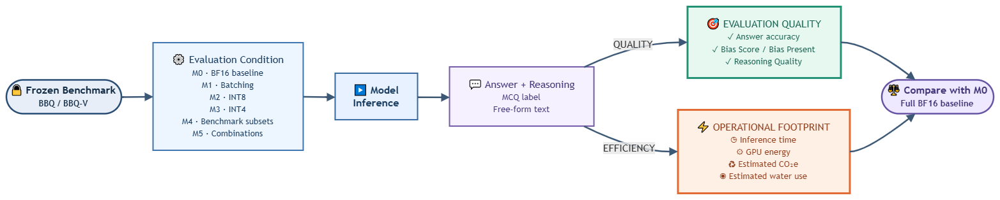

# Stress-Testing Efficient Responsible-AI Evaluation: When Compute Savings Change Benchmark Conclusions

**Authors:** [Ahmed El Kady](https://github.com/goushaa)<sup>1</sup>,
[Aravind Narayanan](https://scholar.google.com/citations?hl=en&user=KCVuy2UAAAAJ)<sup>1</sup>,
[Rehana Noorani](https://scholar.google.com/citations?user=_qrSPWYAAAAJ&hl=en&oi=ao)<sup>2</sup>,
[Yani Ioannou](https://scholar.google.com/citations?user=Qy9yv44AAAAJ&hl=en)<sup>3</sup>, and
[Shaina Raza](https://scholar.google.com/citations?user=chcz7RMAAAAJ&hl=en)<sup>1,\*</sup>

<sup>1</sup>Vector Institute  <sup>2</sup>Independent researcher  <sup>3</sup>University of Calgary

<sup>\*</sup>Corresponding author: [shaina.raza@vectorinstitute.ai](mailto:shaina.raza@vectorinstitute.ai)

Responsible-AI evaluation has a computational footprint, yet efficiency is
rarely assessed alongside the conclusions that benchmarks are meant to support.
We evaluate Qwen2.5-VL-7B, Qwen3-VL-30B-A3B, and Gemma-4-12B-it on BBQ and
BBQ-V under seven conditions spanning batching, quantization, benchmark
reduction, and their combinations.



Each intervention is compared with the same full-benchmark BF16 baseline (M0).
We jointly measure evaluation quality (accuracy, bias, reasoning quality) and
operational footprint (inference time, GPU energy, estimated CO₂e, and water).

## Main findings

- Larger batching changes accuracy by no more than 0.35 percentage points
  across the six reported model--dataset settings, while measured energy is
  lower in five of six settings.
- INT8 preserves average quality in many settings but uses 79--326% more GPU
  energy than BF16 in this campaign; INT4 produces the largest model- and
  context-dependent quality changes.
- The smallest reduced subsets lower measured GPU energy by about 87% across
  all six settings, while very small subsets are less stable. M5a (50% subset
  plus larger batch) generally retains near-baseline accuracy with substantial
  runtime and energy savings.

P.S. These are experimental results, not universal claims. 

## Links

- **Project website:** [vectorinstitute.github.io/sustainable-rai-evaluation](https://vectorinstitute.github.io/sustainable-rai-evaluation/) ([source in `doc/`](doc/))
- **Code:** [VectorInstitute/sustainable-rai-evaluation](https://github.com/VectorInstitute/sustainable-rai-evaluation)
- **Paper:** [arXiv:2608.31108](https://arxiv.org/abs/2608.31108)
- **BBQ (original benchmark):** [NYU BBQ repository](https://github.com/nyu-mll/BBQ)
- **BBQ-V (original benchmark):** [UCF-CRCV BBQ-Vision repository](https://github.com/UCF-CRCV/BBQ-Vision)

## Datasets and frozen evaluation sets

BBQ and BBQ-V are third-party benchmarks created by their original authors.
This repository does **not** redistribute their questions, answer choices,
labels, annotations, or images. It does not host a dataset download.

Instead, [`data/manifests/`](data/manifests/) contains metadata-only frozen
evaluation manifests. They identify the exact source records used in this
paper without carrying any benchmark payload. Obtain the original datasets
from their official sources under their original terms, then use the manifests
and [reproduction guide](REPRODUCIBILITY.md) to reconstruct and verify the
same evaluation membership.

The full frozen evaluation sets contain:

| Benchmark | Frozen rows | Natural units | Membership key |
| --- | ---: | ---: | --- |
| BBQ | 2,000 | 500 complete cases | `(category, case_id)` |
| BBQ-V | 1,998 | 389 complete scenarios | `unique_question_id` |

The exact M4 reduced-subset memberships used by the campaign remain available
as `data/manifests/bbq_m4_subsets.json` and
`data/manifests/bbq_v_m4_subsets.json`.

## Reproduction overview

1. Obtain BBQ and BBQ-V from their official upstream projects and comply with
   their respective terms and licenses.
2. Prepare the frozen records using the metadata-only manifests in
   [`data/manifests/`](data/manifests/); do not substitute or augment records.
3. Validate the prepared membership:

   ```bash
   python scripts/verify_frozen_manifests.py \
     --bbq-sample /path/to/bbq/sample.csv \
     --bbq-v-sample /path/to/bbq_v/sample.csv
   ```

4. Install the optional evaluation dependencies and run the portable profiles as
   documented in [REPRODUCIBILITY.md](REPRODUCIBILITY.md).

The public runner includes the finalized Qwen profiles and Gemma-4-12B-it
support. Gemma requires a separate compatible Transformers 5.x environment;
see the reproduction guide before attempting a Gemma run.

## Repository structure

```text
data/manifests/       Metadata-only full-set and M4 membership manifests
doc/                  Static project website published to GitHub Pages
docs/                 Methodology, data-license, and API notes (markdown, not a site)
results/figures/      Reviewed paper figures, including the evaluation workflow
scripts/              Lightweight public verification utilities
src/                  Portable evaluation package
REPRODUCIBILITY.md    Frozen-set reconstruction and validation guide
```

## License and provenance

The code in this repository is released under its own license. That license
does not grant rights to BBQ, BBQ-V, model weights, or any upstream material.
See [docs/data-and-licenses.md](docs/data-and-licenses.md) and the upstream
projects for applicable dataset and model terms.

## Acknowledgments

Resources used in preparing this research were provided, in part, by the
Province of Ontario, the Government of Canada through CIFAR, and companies
sponsoring the Vector Institute.

This research was funded by the European Union's Horizon Europe research and
innovation programme under the AIXPERT project (Grant Agreement No. 101214389).

## Citation

```bibtex
@misc{kady2026stresstestingefficientresponsibleaievaluation,
  title = {Stress-Testing Efficient Responsible-AI Evaluation: When Compute Savings Change Benchmark Conclusions},
  author = {Ahmed El Kady and Aravind Narayanan and Rehana Noorani and Yani Ioannou and Shaina Raza},
  year = {2026},
  eprint = {2608.31108},
  archivePrefix = {arXiv},
  primaryClass = {cs.LG},
  url = {https://arxiv.org/abs/2608.31108},
}
```

## Contact

For questions or collaborations, please open an issue in this repository or
contact the corresponding author at
[shaina.raza@vectorinstitute.ai](mailto:shaina.raza@vectorinstitute.ai), as
listed in the paper.
